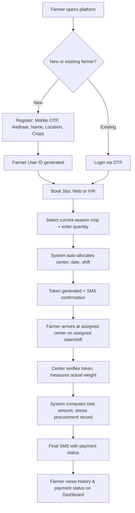
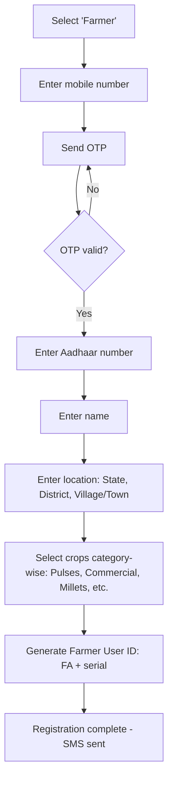
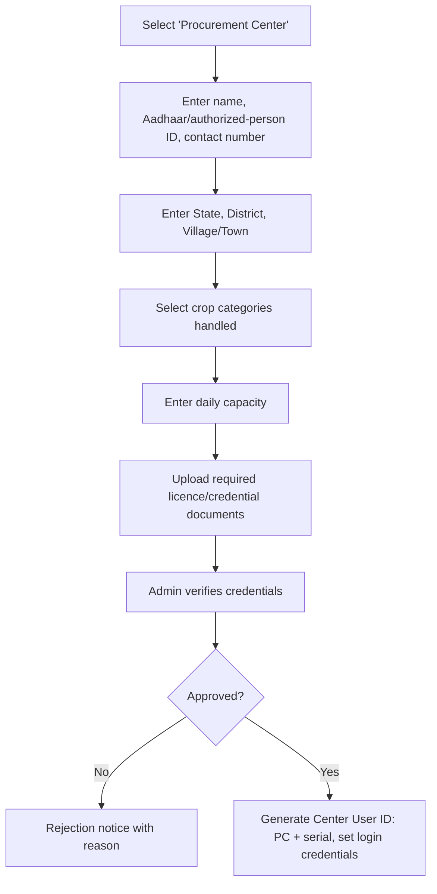
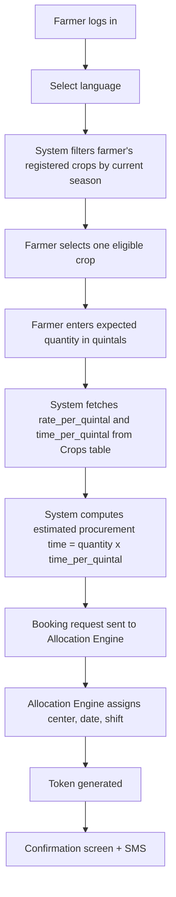
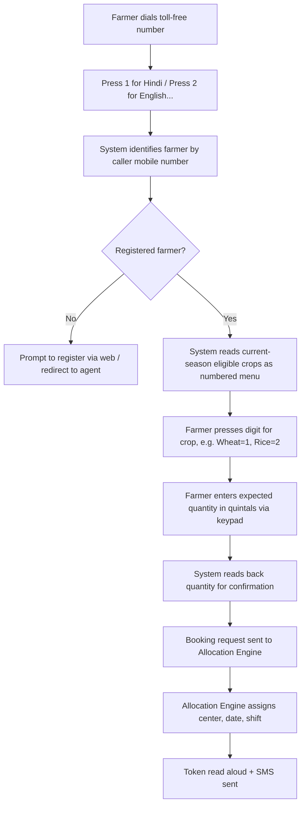
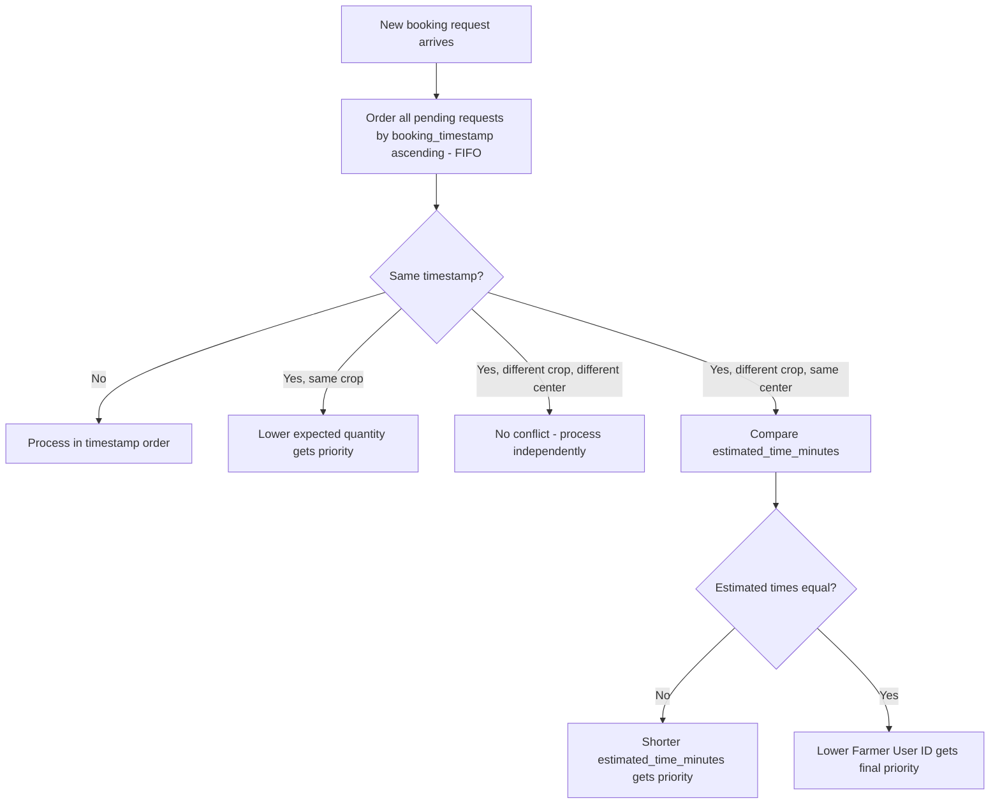
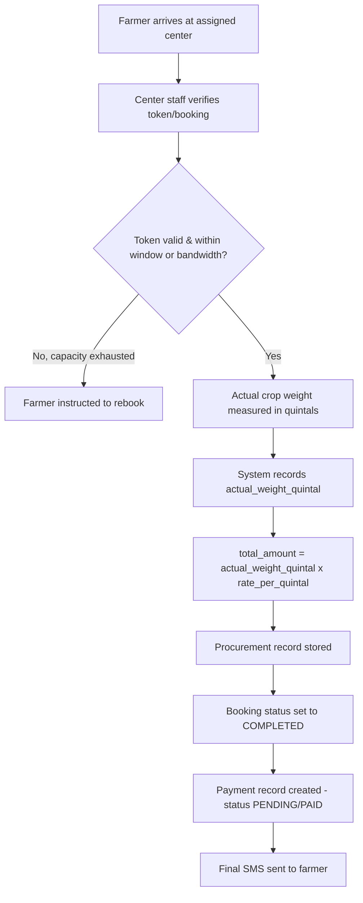
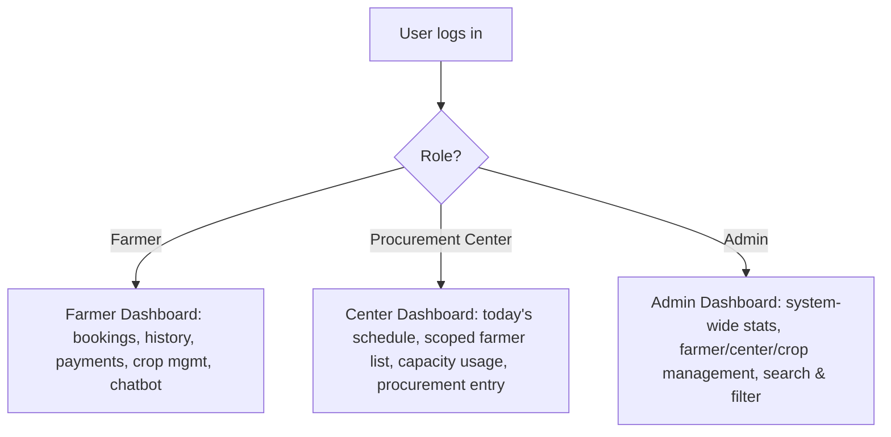
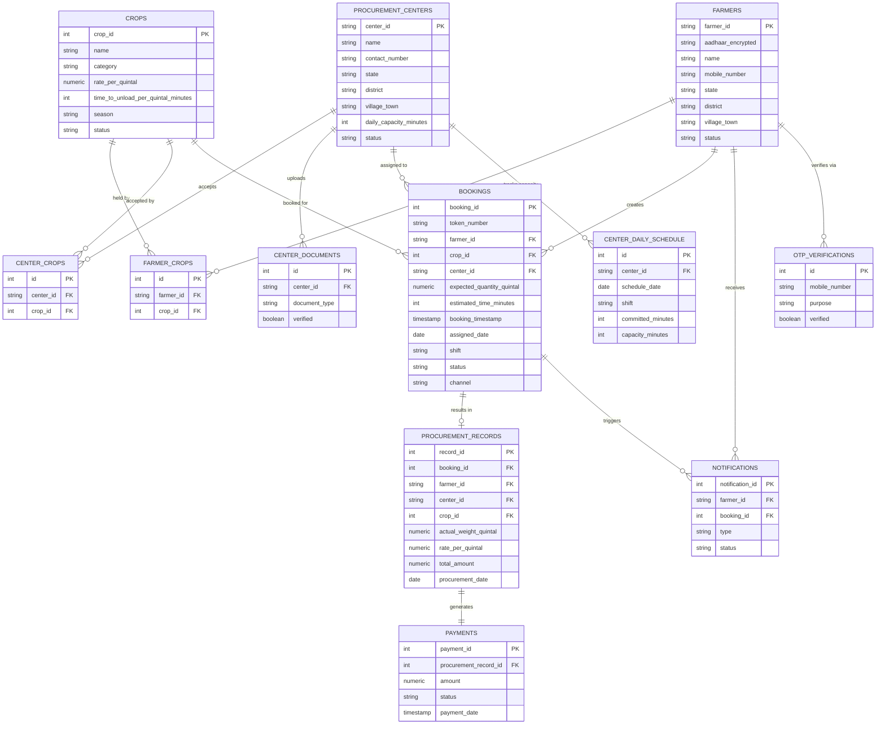
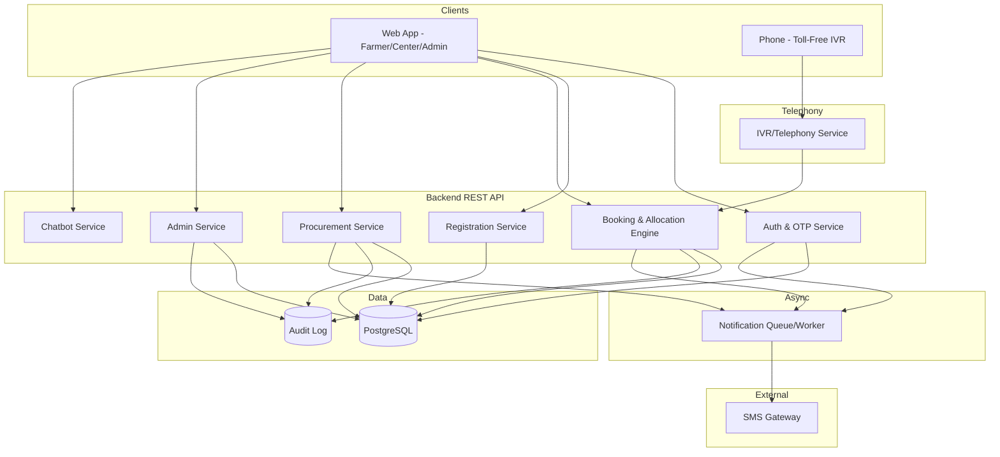

# Product Requirements Document
## Digital Farmer Procurement-Center Slot Booking Platform (Prototype)

**Document version:** 1.0
**Status:** Draft for engineering handoff
**Prepared for:** Software Development Team

---

## Table of Contents
1. Executive Summary
2. Problem Statement
3. Goals
4. Objectives
5. Scope
6. User Roles
7. User Journey
8. Detailed Functional Flow
9. Registration
10. Slot Booking
11. Automatic Allocation Logic
12. Procurement
13. Dashboards
14. Notifications
15. Chatbot
16. Functional Requirements
17. Non-Functional Requirements
18. User Stories
19. Acceptance Criteria
20. Business Rules
21. Database Design
22. ER Diagram
23. API Design
24. UI/UX Screens
25. System Architecture
26. Security and Privacy
27. Edge Cases
28. MVP Scope
29. Future Enhancements
30. Success Metrics
31. Risks and Mitigations

---

## 1. Executive Summary

Agricultural procurement centers currently rely on a manual, offline, first-come-crowd-based system for accepting crops from farmers. Farmers travel to a center without any confirmed date or time, wait in unstructured queues, and centers have no reliable way to forecast daily load. This causes long waits, overcrowding, unpredictable procurement days, and no digital record of transactions.

This PRD defines a prototype web-based platform (with a parallel toll-free IVR channel) that digitizes the entire procurement lifecycle:

`Farmer Registration → Slot Booking → Automatic Slot Allocation → Procurement → Payment/Transaction Record → Dashboard`

The platform is semi-automated: farmers and procurement centers do not manually negotiate a date, time, or center. The system computes the appropriate procurement center and the earliest available date/shift automatically, based on crop eligibility, seasonal relevance, center capacity, and booking order (FIFO). The system exposes three role-based portals — **Farmer**, **Procurement Center**, and **Admin** — each with a purpose-built dashboard, and it maintains an auditable, structured transaction history that supports downstream payment reconciliation.

This document is written to be directly actionable by an engineering team: it specifies data models, APIs, allocation algorithms, tie-breaking rules, UI screens, and non-functional constraints sufficient to begin sprint planning.

---

## 2. Problem Statement

| Current State (Offline) | Consequence |
|---|---|
| Farmers arrive at procurement centers without prior confirmation | Overcrowding, long queues, wasted travel |
| No digital record of expected vs. actual crop quantity | Disputes, no audit trail |
| Centers cannot forecast daily load | Under- or over-scheduling, wasted capacity |
| No unified farmer identity across centers | Duplicate/inconsistent records |
| Rate and payment calculation done manually | Errors, delays, no transparency for farmers |
| No channel for farmers without smartphones/internet | Digital exclusion of a large rural population |

The platform must solve these problems while remaining simple enough to be delivered as a working prototype.

---

## 3. Goals

- Digitize slot booking so farmers know their assigned center, date, and shift in advance.
- Eliminate manual, ad-hoc center/date selection by automating allocation.
- Give every stakeholder (farmer, center, admin) a role-appropriate, real-time view of the process.
- Provide an inclusive booking channel (toll-free IVR) alongside the web application.
- Maintain accurate, auditable procurement and payment records.

## 4. Objectives

- O1: Reduce farmer wait time by pre-assigning arrival shifts.
- O2: Balance load across procurement centers using capacity-aware allocation.
- O3: Provide farmers a single, reusable digital identity (Farmer User ID) independent of crop or center.
- O4: Support two booking channels (Web, IVR) that converge on the same allocation engine.
- O5: Produce a transparent, itemized payment record derived from actual measured weight.
- O6: Ensure sensitive data (Aadhaar) is protected and never exposed to unauthorized roles.

---

## 5. Scope

**In scope (prototype):**
- Farmer, Procurement Center, and Admin web portals.
- OTP-based farmer authentication; credential-based login for centers and admins.
- Farmer registration with multi-crop selection.
- Procurement center registration with capacity and crop-category configuration.
- Web and IVR slot booking with automatic center/date/shift allocation.
- Season-based crop filtering at booking time.
- FIFO-based allocation engine with defined tie-breaking rules.
- Token generation and SMS notifications.
- Procurement-day recording of actual weight and computed payment.
- Role-based dashboards with search/filter.
- Simple FAQ-style help chatbot.
- Cancellation / rescheduling (web + IVR).

**Out of scope (prototype):**
- Real payment gateway / bank settlement integration (payment status is recorded, not processed).
- Multi-language chatbot with NLP/AI.
- Native mobile apps (web is mobile-responsive instead).
- Complex warehouse/inventory management beyond procurement recording.
- Weather/logistics/transport integration.

---

## 6. User Roles

| Role | Description | Access |
|---|---|---|
| **Farmer** | Registers once, books slots, tracks procurement and payment | Own data only |
| **Procurement Center** | Registers with license/credentials, manages capacity, records procurement | Data scoped to bookings/transactions associated with that center only |
| **Admin** | Predefined accounts; oversees entire system | Full read access; controlled write access via role-specific management screens (not raw DB editing) |

---

## 7. User Journey



---

## 8. Detailed Functional Flow

The end-to-end flow has six stages. Each stage is owned by a specific service/module in the architecture (Section 25).

| Stage | Trigger | Primary Actor | Output |
|---|---|---|---|
| 1. Registration | Farmer/Center opens platform | Farmer / Center | Farmer User ID / Center User ID |
| 2. Slot Booking | Farmer books via Web/IVR | Farmer | Booking request (crop, quantity) |
| 3. Automatic Allocation | System processes booking | System | Assigned center, date, shift, token |
| 4. Procurement | Farmer arrives on assigned day | Center staff | Actual weight, computed amount |
| 5. Payment/Transaction Record | Procurement completed | System | Payment record, status |
| 6. Dashboard | Any time | Farmer/Center/Admin | Read-only role-scoped views |

---

## 9. Registration

### 9.1 Farmer Registration Flow



Rules:
- Registration happens **once** per mobile number / Aadhaar combination (see FR-006, Edge Cases §27).
- A farmer may select **multiple crops** across multiple categories at registration, and may modify this selection later.
- **Farmer User ID format:** `FA` + zero-padded serial number, e.g. `FA000125`. The ID never encodes a procurement center, because a farmer may sell different crops at different centers over time.
- Aadhaar is stored **hashed/encrypted at rest** (Section 26) and is never shown on any dashboard other than to Admin (masked) and the farmer's own profile.

### 9.2 Procurement Center Registration Flow



- **Center User ID format:** `PC` + serial, e.g. `PC000045`.
- Centers remain in a `PENDING_VERIFICATION` state until Admin approves submitted credentials/license documents. Only `ACTIVE` centers are eligible for auto-allocation.
- Centers can later modify crop selection and daily capacity (subject to Admin visibility/audit).

### 9.3 Admin Accounts
- Admin accounts are **predefined and seeded** at deployment time (no self-registration screen).
- Admin logs in directly with username/password (+ optional OTP for the prototype's security baseline).

---

## 10. Slot Booking

### 10.1 Web Booking Flow



### 10.2 IVR (Toll-Free) Booking Flow



Key rules common to both channels:
- Quantity is entered as an **exact number of quintals** (e.g. 5, 10, 30, 500) — no fixed weight bands (e.g. "<5 ton", "5-50 ton") are used.
- Only **current-season** crops from the farmer's registered crop list are offered (Section 8.3 filtering logic below).
- The farmer never selects a procurement center or a date manually — both are system-assigned.
- Rate is never entered manually by the farmer; it is fetched from the Crops table.

### 10.3 Season-Based Crop Filtering
- Each crop has one `season` value in the Crops table.
- At booking time, the system computes `current_season` (configurable, e.g. via calendar mapping or an admin-configurable current-season flag) and filters the farmer's registered crops to only those matching `current_season`.
- Example: farmer has 20 registered crops; only 4 match the current season → only those 4 appear in the Web crop picker / IVR menu.

---

## 11. Automatic Allocation Logic

### 11.1 Inputs to Allocation
| Input | Source |
|---|---|
| Crop | Farmer selection (season-filtered) |
| Expected quantity (quintals) | Farmer input |
| `rate_per_quintal`, `time_to_unload_per_quintal` | Crops table |
| Centers that accept this crop | `center_crops` table |
| Center capacity remaining per date/shift | `center_daily_schedule` (derived from bookings) |
| Booking timestamp | System clock at submission |

### 11.2 Estimated Procurement Time
```
estimated_time_minutes = expected_quantity_quintal * crop.time_to_unload_per_quintal
```
Example: Crop A, 10 quintal at 5 min/quintal → 50 minutes. No additional fixed handling buffer is added in the prototype (Section 9 of source spec).

### 11.3 Daily Scheduling Capacity ("7-hour rule with ~1-hour bandwidth")
- Each procurement center's **bookable/plannable capacity** is fixed at **7 hours (420 minutes) per day**, split across two shifts (Section 11.5).
- The center's **actual physical operating window is ~8 hours**, giving roughly **1 hour of operational bandwidth** absorbing late arrivals and minor delays.
- This 8-hour figure is a soft ceiling, not an exact per-minute boundary:
  - 7h 40m of committed procurement → rounds to "approximately 8h" utilization, treated as within bounds.
  - 8h 10m → still treated as "approximately 8h", allowed.
  - The system must **never let total committed time (booked + in-progress) exceed ~8h 30m (510 minutes)** for a single center/date/shift-day combination. This is the hard operational ceiling.
- Implementation approach: allocation always books against the **7-hour (420 min) planning capacity per day** as the primary limit used to decide "is this day/shift full"; the extra ~60-90 minutes of bandwidth is *not* pre-allocated to bookings — it exists only to absorb real-world slippage (late arrivals still being served, Section 17). The allocation engine therefore rejects new bookings once **planned capacity reaches 420 minutes** for that center/date/shift, even though actual operations may run a bit longer.

### 11.4 Center Selection Rule
For a given crop and quantity, the Allocation Engine:
1. Filters `procurement_centers` where `status = ACTIVE` AND the center accepts this crop (`center_crops`).
2. For each eligible center, computes remaining planning capacity for candidate dates: `remaining = 420 - sum(estimated_time_minutes of existing non-cancelled bookings for that center/date/shift)`.
3. Picks the **earliest available date/shift, at the nearest eligible center with sufficient remaining capacity** for this booking's `estimated_time_minutes`. (Prototype rule: centers are evaluated in a fixed practical order — e.g. by district/proximity to farmer's registered village/town, then by remaining capacity — the exact ranking function is configurable, but must be deterministic and documented in code.)
4. If no center has capacity on the earliest date, the engine checks the next date, and so on, until capacity is found.

### 11.5 Shift Model
| Shift | Arrival Window | Procurement Window | Planning Capacity |
|---|---|---|---|
| Shift 1 | 8:00 AM – 9:00 AM | ~9:00 AM – 12:00 PM | up to 210 min (half of 420) |
| Shift 2 | 1:00 PM – 2:00 PM | ~2:00 PM – 5:00 PM | up to 210 min (half of 420) |

- Allocation within a shift is **not** a fixed "N tokens per shift" count. It is driven purely by summed `estimated_time_minutes` against the shift's share of the 420-minute daily capacity.
- The 420-minute daily capacity may be split evenly (210/210) or reallocated between shifts by Admin per center if one shift consistently has lower demand (configurable per center, default 50/50).

### 11.6 Date Allocation
- The farmer never selects a date. The engine allocates the **earliest date** where the selected center (or any eligible center, per §11.4) has remaining capacity for the requested crop.
- If the current day is full (420 min reached) for all eligible centers, the booking automatically rolls to the **next available day**.

### 11.7 FIFO and Tie-Breaking Rules



Priority order, summarized:
1. **Primary:** `booking_timestamp` ascending (FIFO).
2. **Tie, same crop:** lower `expected_quantity_quintal` wins.
3. **Tie, different crop, different center:** no conflict — both proceed independently.
4. **Tie, different crop, same center:** shorter `estimated_time_minutes` wins.
5. **Tie, estimated times equal:** lower `farmer_id` (User ID) wins as the final deterministic tie-breaker.

### 11.8 Booking Constraints
- A farmer **cannot** book the same crop twice for the same day.
- A farmer **can** book different crops on the same day; each gets its own booking, token, and (independently allocated) slot/center.
- Booking creation is transactional: capacity check + reservation must be atomic (row-level lock or serializable transaction on `center_daily_schedule`) to avoid race conditions from concurrent Web/IVR bookings.

---

## 12. Procurement

### 12.1 Procurement-Day Flow



### 12.2 Late Arrival Handling (Section 17 of source spec)
- If a farmer does not arrive within the assigned arrival window:
  - If the center's **remaining operational bandwidth** (the soft ~1 hour beyond the 420-minute plan, bounded at 510 minutes total, §11.3) can still absorb the job → procurement proceeds as a late arrival.
  - If insufficient bandwidth remains → the farmer is required to rebook (system prompts rebooking via SMS/IVR/web).
- This logic is intentionally simple for the prototype: a single boolean capacity check, no dynamic re-optimization of the day's schedule.

### 12.3 Actual vs. Expected Quantity
- The **rate is always the crop's current `rate_per_quintal`** at time of procurement (not a rate frozen at booking time, unless the business decides otherwise — configurable flag, default: use rate at procurement time).
- `total_amount` is always computed from **actual measured weight**, never the expected/booked quantity.
- A significant difference between expected and actual quantity does not block procurement in the prototype; it is simply recorded (see Edge Cases §27).

---

## 13. Dashboards

### 13.1 Farmer Dashboard — Contents
- Today's booking: token, assigned center, date, shift, expected quantity, estimated time, live status.
- Status pipeline: **Booked → Scheduled → Arrived → Procurement → Completed** (or **Cancelled**).
- Today's selling details once procurement is complete (weight, rate, amount, payment status).
- Past procurement history: date, crop, quantity, rate, amount, payment status.
- Booking history with cancel/rebook actions (only for future/active bookings).
- Crop management (add/remove registered crops).
- Help chatbot entry point.

### 13.2 Procurement Center Dashboard — Contents
- Today's schedule: list of bookings (token, farmer name, crop, quantity, estimated time, shift).
- Farmer list **scoped strictly to bookings/transactions associated with this center** — never derived from a farmer's User ID prefix (Business Rule §32.22), because a farmer's center association can differ per crop and per booking.
- Daily capacity usage: minutes committed vs. 420-minute plan vs. ~510-minute hard ceiling, remaining capacity.
- Procurement entry screen to log actual weight and complete a booking.
- Aadhaar and other sensitive farmer fields are **hidden/masked** on this dashboard.
- Search/filter (farmer, crop, token, date, status) and procurement history for this center.

### 13.3 Admin Dashboard — Contents
- System-wide counts: total farmers, total centers, current bookings, today's procurement, historical procurement.
- Crop statistics, center statistics, capacity utilization, payment/transaction overview.
- Search/filter across farmers, centers, crops, dates, booking status.
- Role-specific management screens (not raw table editors): Farmer Management, Center Management, Crop Management (Section 6 constraint — see also Section 24 UI Screens and Section 26 Security).



---

## 14. Notifications

All notifications in the prototype are delivered via **SMS** through an SMS gateway integration.

| Event | Trigger | Key content |
|---|---|---|
| OTP | Login/registration | 6-digit OTP, expiry |
| Registration success | Farmer/Center approved | User ID, welcome message |
| Booking confirmation | Booking created | Token, crop, quantity |
| Token generation | Booking created | Token number |
| Assigned center | Allocation complete | Center name, address |
| Assigned date & shift | Allocation complete | Date, shift window |
| Estimated procurement time | Allocation complete | Minutes estimate |
| Booking cancellation | Farmer/Center cancels | Token, refunded capacity note |
| Rebooking | Farmer rebooks | New token, date, shift |
| Procurement completion | Procurement recorded | Actual weight, rate, amount |
| Payment status | Payment record updated | Amount, status (Pending/Paid) |

Notification delivery is asynchronous (queued) and retried on transient failure; failures are logged (Edge Cases §27, Audit Log §21.9).

---

## 15. Chatbot

A simple, **rule-based FAQ chatbot** (no LLM/AI required for the prototype) embedded in the Farmer web dashboard (and optionally Center dashboard). It answers a fixed set of intents by keyword/button matching:

- How to register
- How to book a slot
- How to cancel a booking
- How to rebook
- What is a token
- How slot allocation works
- How procurement works
- How payment is calculated
- How to contact support / escalate an issue

Implementation: a static intent → answer JSON/table served by a lightweight `/chatbot/query` API, with a simple keyword-matching or button-driven UI (no external AI service required, keeping the prototype simple and offline-capable).

---

## 16. Functional Requirements

### 16.1 Authentication & OTP
| ID | Requirement |
|---|---|
| FR-001 | System shall allow a farmer to authenticate using mobile number + OTP. |
| FR-002 | System shall generate a 6-digit OTP valid for 5 minutes, with a maximum of 3 verification attempts. |
| FR-003 | System shall allow OTP resend after a 30-second cooldown. |
| FR-004 | System shall authenticate Procurement Center and Admin users via username/password credentials (Center may additionally require OTP as second factor). |
| FR-005 | System shall lock an account for 15 minutes after 5 consecutive failed login attempts. |

### 16.2 Registration
| ID | Requirement |
|---|---|
| FR-006 | System shall prevent duplicate farmer registration for the same mobile number or Aadhaar. |
| FR-007 | System shall generate a unique Farmer User ID in format `FA######` on successful registration, with no procurement-center encoding. |
| FR-008 | System shall allow a farmer to select one or more crops, across one or more categories, during registration. |
| FR-009 | System shall capture State, District, and Village/Town as structured location fields for a farmer. |
| FR-010 | System shall allow a Procurement Center to register with name, authorized-person ID, location, crop categories handled, daily capacity, and required licence/credential documents. |
| FR-011 | System shall place a newly registered Procurement Center in `PENDING_VERIFICATION` status until Admin approval. |
| FR-012 | System shall generate a unique Center User ID in format `PC######` on approval. |
| FR-013 | Admin accounts shall be predefined/seeded; the system shall not expose a public Admin self-registration screen. |

### 16.3 Crop & Farmer-Crop Management
| ID | Requirement |
|---|---|
| FR-014 | System shall maintain a Crops master table with `rate_per_quintal`, `time_to_unload_per_quintal`, and `season`. |
| FR-015 | Admin shall be able to add, edit, and remove crops via a dedicated Crop Management screen. |
| FR-016 | System shall maintain a many-to-many Farmer–Crop relationship allowing a farmer to hold multiple crops. |
| FR-017 | Farmer shall be able to modify their registered crop list post-registration. |
| FR-018 | System shall filter a farmer's eligible booking crops to only those matching the current season. |

### 16.4 Procurement Center Management
| ID | Requirement |
|---|---|
| FR-019 | Procurement Center shall be able to modify their accepted crop list and daily capacity. |
| FR-020 | System shall maintain a many-to-many Center–Crop relationship. |
| FR-021 | Admin shall be able to view, verify, approve, suspend, or edit Procurement Center profiles via a dedicated Center Management screen. |

### 16.5 Slot Booking (Web & IVR)
| ID | Requirement |
|---|---|
| FR-022 | System shall allow a farmer to book a slot via the Web interface. |
| FR-023 | System shall allow a farmer to book a slot via a toll-free IVR system using the same allocation engine as Web. |
| FR-024 | System shall require quantity to be entered as an exact number of quintals (no fixed weight bands). |
| FR-025 | System shall fetch `rate_per_quintal` automatically from the Crops table; farmers shall never enter a rate manually. |
| FR-026 | System shall compute `estimated_time_minutes = expected_quantity_quintal * time_to_unload_per_quintal`. |
| FR-027 | System shall reject a booking request for a crop not in-season for that farmer. |
| FR-028 | System shall reject a duplicate same-day booking for the same farmer + crop combination. |
| FR-029 | System shall allow a farmer to book different crops on the same day, each receiving an independent slot. |

### 16.6 Automatic Allocation
| ID | Requirement |
|---|---|
| FR-030 | System shall automatically select a procurement center for each booking based on crop eligibility, capacity, and location — never via manual farmer selection. |
| FR-031 | System shall automatically allocate the earliest available date and shift with sufficient remaining capacity. |
| FR-032 | System shall enforce a 420-minute (7-hour) planning capacity per center per day, split across two shifts. |
| FR-033 | System shall treat ~480 minutes (8 hours) as an approximate operational ceiling and never allow committed time to exceed ~510 minutes (8.5 hours) for a center/day. |
| FR-034 | System shall apply FIFO ordering by `booking_timestamp`, with defined tie-breaking rules (Section 11.7), when multiple requests compete for the same capacity. |
| FR-035 | System shall roll a booking to the next available date automatically if the current day is fully booked. |
| FR-036 | Allocation and capacity-check operations shall be atomic/transactional to prevent race conditions under concurrent bookings. |

### 16.7 Token & Confirmation
| ID | Requirement |
|---|---|
| FR-037 | System shall generate a unique token number for every successful booking. |
| FR-038 | System shall send a confirmation SMS containing token, crop, rate, expected quantity, assigned date/shift, estimated time, and center details. |

### 16.8 Cancellation & Rescheduling
| ID | Requirement |
|---|---|
| FR-039 | Farmer shall be able to cancel a booking via Web or IVR. |
| FR-040 | Farmer shall be able to rebook via Web or IVR after cancellation. |
| FR-041 | System shall release the cancelled booking's committed capacity immediately so it can be reused by subsequent bookings. |

### 16.9 Procurement & Payment
| ID | Requirement |
|---|---|
| FR-042 | Center staff shall be able to verify a token and record actual measured weight in quintals. |
| FR-043 | System shall compute `total_amount = actual_weight_quintal * rate_per_quintal`. |
| FR-044 | System shall persist a Procurement Record linked to the originating booking. |
| FR-045 | System shall create/update a Payment record with status (Pending/Paid/Failed) tied to each Procurement Record. |
| FR-046 | System shall send a final SMS with actual weight, rate, total amount, and payment status. |
| FR-047 | System shall permit procurement to proceed for a late-arriving farmer only if remaining operational bandwidth allows it; otherwise, it shall prompt rebooking. |

### 16.10 Dashboards & Search
| ID | Requirement |
|---|---|
| FR-048 | System shall provide a Farmer Dashboard showing current booking status, history, payments, and crop management. |
| FR-049 | System shall provide a Procurement Center Dashboard scoped strictly to farmers/bookings associated with that center. |
| FR-050 | System shall mask/hide Aadhaar and other sensitive farmer fields on the Center Dashboard. |
| FR-051 | System shall provide an Admin Dashboard with system-wide statistics and management screens (not raw database access). |
| FR-052 | System shall provide search/filter capability on all three dashboards per the fields defined in Section 22. |

### 16.11 Notifications
| ID | Requirement |
|---|---|
| FR-053 | System shall send SMS notifications for all events listed in Section 14 via an integrated SMS gateway. |
| FR-054 | System shall queue and retry failed SMS deliveries, and log delivery failures. |

### 16.12 Chatbot
| ID | Requirement |
|---|---|
| FR-055 | System shall provide a rule-based FAQ chatbot answering the fixed intents listed in Section 15. |

---

## 17. Non-Functional Requirements

| Category | Requirement |
|---|---|
| **Security** | All authentication tokens (JWT/session) must be short-lived and refreshed securely; passwords hashed with bcrypt/argon2; API endpoints authorized by role (RBAC) at the middleware layer. |
| **Privacy** | Aadhaar numbers must be encrypted at rest (e.g., AES-256) and masked in all UI except the farmer's own profile and Admin's controlled verification screen (last 4 digits only). |
| **Role-Based Access Control** | Every API endpoint must enforce role + ownership checks (e.g., a Center can only fetch bookings where `booking.center_id = current_center_id`). |
| **Scalability** | Architecture must support horizontal scaling of the API layer; database must support read replicas for dashboard/reporting queries. |
| **Reliability** | Booking/allocation must be transactional; SMS/notification failures must not roll back a successful booking. |
| **Performance** | Slot booking (including allocation) should respond within 2–3 seconds under normal load for the prototype. |
| **Availability** | Target ~99% uptime for the prototype environment; IVR and Web must degrade gracefully if the SMS gateway is temporarily unavailable (booking still succeeds; SMS retried). |
| **Auditability** | Every state-changing action (booking, cancellation, procurement, payment update, admin edit) must be recorded in an audit log with actor, timestamp, and before/after values. |
| **Accessibility** | Web UI must support large-touch-target, icon-based navigation for low-literacy users; IVR must support at least two languages. |
| **Mobile-Friendly** | Web UI must be fully responsive (mobile-first design), usable on low-end Android browsers. |
| **Low-Bandwidth Usability** | Web pages must be lightweight (minimal JS bundle, compressed assets, works acceptably on 2G/3G). |
| **Data Validation** | All inputs (mobile number, Aadhaar format, quantity as positive numeric, dates) must be validated both client- and server-side. |

---

## 18. User Stories

### Farmer
| ID | Story | Acceptance Criteria |
|---|---|---|
| US-F01 | As a farmer, I want to register once with my mobile, Aadhaar, name, location and crops, so that I get a single reusable Farmer ID. | Given valid OTP and unique mobile/Aadhaar, a Farmer User ID (`FA######`) is generated and an SMS confirmation is sent. Duplicate mobile/Aadhaar is rejected with a clear error. |
| US-F02 | As a farmer, I want to book a slot for an in-season crop by entering exact quantity in quintals, so that I don't have to guess a weight band. | Only current-season registered crops appear in the picker; quantity field accepts any positive numeric quintal value; rate is auto-filled, not editable. |
| US-F03 | As a farmer, I want the system to automatically assign my procurement center and date, so that I don't need to negotiate manually. | On booking submission, response includes an assigned `center_id`, `assigned_date`, and `shift` with no center-selection step shown to the farmer. |
| US-F04 | As a farmer, I want to receive a token and SMS confirmation, so that I have proof of my booking. | A unique token is generated and an SMS is sent containing token, crop, rate, quantity, date, shift, and center details within a defined time (e.g. 60s). |
| US-F05 | As a farmer, I want to cancel or reschedule my booking via Web or IVR, so that I have flexibility. | Cancelling a future booking releases its capacity immediately and is reflected in the center's available capacity within the same transaction. |
| US-F06 | As a farmer, I want to see my past and current procurement records with rate and payment status, so that I can track my income. | Dashboard lists all procurement records for the logged-in farmer only, each with weight, rate, amount, and payment status. |

### Procurement Center
| ID | Story | Acceptance Criteria |
|---|---|---|
| US-C01 | As a procurement center, I want to register with my capacity and accepted crops and get verified, so that I can start receiving bookings. | Center profile is created in `PENDING_VERIFICATION`; becomes `ACTIVE` and eligible for allocation only after Admin approval. |
| US-C02 | As a procurement center, I want to see only the farmers/bookings associated with my center, so that I don't see irrelevant or sensitive data. | API returns bookings/procurement records filtered strictly by `center_id = current center`; Aadhaar field is omitted/masked in the response. |
| US-C03 | As a procurement center, I want to record the actual measured weight for a farmer's booking, so that payment can be calculated correctly. | Entering actual weight computes `total_amount` automatically and updates booking status to `COMPLETED`; a final SMS is triggered. |
| US-C04 | As a procurement center, I want to view my daily capacity usage, so that I know how much bandwidth remains. | Dashboard shows committed minutes vs. 420-min plan and remaining bandwidth up to the ~510-min ceiling, updated in near real time. |

### Admin
| ID | Story | Acceptance Criteria |
|---|---|---|
| US-A01 | As an admin, I want to manage crops (add/edit/remove) through a dedicated screen, so that I control rate/time/season data without unsafe direct DB access. | Crop CRUD operations go through validated API endpoints with audit logging; no raw SQL/table editor is exposed. |
| US-A02 | As an admin, I want to verify and approve new procurement centers, so that only legitimate centers can receive bookings. | Only Admin-approved centers transition from `PENDING_VERIFICATION` to `ACTIVE` and become eligible for the allocation engine. |
| US-A03 | As an admin, I want to search/filter across farmers, centers, crops, and bookings, so that I can monitor the system. | Search supports at least the fields listed in Section 22 and returns paginated results within acceptable performance limits. |

---

## 19. Acceptance Criteria (Cross-Cutting)

- All monetary/quantity calculations (`estimated_time_minutes`, `total_amount`) must be computed server-side, never trusted from client input.
- Every booking must have exactly one, immutable `booking_timestamp` used for FIFO ordering.
- No UI screen for any role may allow direct editing of raw database rows; all writes go through validated, role-scoped API endpoints.
- Aadhaar must never appear in any API response consumed by the Procurement Center role.
- Cancelling a booking must be reflected in center capacity within the same database transaction (no eventual-consistency window that could double-book).

---

## 20. Business Rules

| # | Rule |
|---|---|
| 1 | Farmer registers only once. |
| 2 | Farmer may register many crops. |
| 3 | Current season filters booking crop options. |
| 4 | Farmer does not select a procurement center. |
| 5 | System automatically allocates procurement center. |
| 6 | Quantity is entered in quintals. |
| 7 | Rate is per quintal. |
| 8 | Procurement time is per quintal. |
| 9 | Estimated time = quantity × time per quintal. |
| 10 | Booking schedule uses 7-hour (420-min) planning capacity. |
| 11 | Actual center operation is approximately 8 hours. |
| 12 | Remaining time acts as operational bandwidth (soft, up to ~8.5h ceiling). |
| 13 | Booking priority is FIFO by `booking_timestamp`. |
| 14 | Tie-breaking rules apply as defined in Section 11.7. |
| 15 | Farmer cannot book the same crop twice on the same day. |
| 16 | Farmer can book different crops on the same day. |
| 17 | Different crops receive different slots. |
| 18 | Farmer cannot select the procurement date manually. |
| 19 | Full days roll bookings to the next available date automatically. |
| 20 | Cancelled capacity is released immediately. |
| 21 | Actual procurement amount uses actual measured weight. |
| 22 | Center dashboard shows only farmers associated with that center's bookings/transactions (not derived from Farmer User ID). |
| 23 | Aadhaar must be protected (encrypted at rest, masked in UI, hidden from Center role). |
| 24 | Admin uses predefined, seeded credentials — no public admin registration. |
| 25 | Admin has controlled, role-specific management interfaces rather than unrestricted raw database editing. |

---

## 21. Database Design

The initial tables proposed in the source specification (Crops, Farmer/User, Farmer Procurement Records, Procurement Center Records) have been **normalized** into a relational schema. Rationale for each change/addition is given below the schema.

### 21.1 Core Tables

**`crops`**
| Column | Type | Notes |
|---|---|---|
| crop_id | PK, int/serial | |
| name | varchar | |
| category | varchar | e.g. Pulses, Commercial, Millets |
| rate_per_quintal | numeric(10,2) | current rate |
| time_to_unload_per_quintal_minutes | int | used for estimated-time calc |
| season | varchar/enum | one season per crop, as specified |
| status | enum(ACTIVE, INACTIVE) | for soft-delete by Admin |
| created_at / updated_at | timestamp | |

**`farmers`**
| Column | Type | Notes |
|---|---|---|
| farmer_id | PK, varchar | format `FA######` |
| aadhaar_encrypted | varchar | encrypted, never plain-text |
| aadhaar_last4 | varchar(4) | for display/verification only |
| name | varchar | |
| mobile_number | varchar, unique | login identifier |
| state | varchar | |
| district | varchar | |
| village_town | varchar | |
| status | enum(ACTIVE, SUSPENDED) | |
| created_at / updated_at | timestamp | |

*Why not a single generic `users` table for all roles?* Farmers, Centers, and Admins have materially different fields (Aadhaar/location/crops vs. capacity/license vs. simple credentials) and different security postures (Aadhaar encryption only relevant to Farmers). Separate tables keep each role's schema simple, avoid nullable-field sprawl, and make RBAC boundary enforcement at the query level straightforward. A common `user_id` **format convention** (`FA`, `PC`, `AD` prefixes) is retained for readability but is not a shared physical table.

**`farmer_crops`** (many-to-many; replaces the flat "crop_weight/crop holdings mapping" field)
| Column | Type | Notes |
|---|---|---|
| id | PK | |
| farmer_id | FK → farmers | |
| crop_id | FK → crops | |
| registered_at | timestamp | |

*Why:* A farmer can hold many crops, and a crop can belong to many farmers — a classic many-to-many that cannot be safely represented as a single delimited field without breaking normalization, indexing, and query performance (e.g. "find all farmers registered for Wheat").

**`procurement_centers`**
| Column | Type | Notes |
|---|---|---|
| center_id | PK, varchar | format `PC######` |
| name | varchar | |
| authorized_person_aadhaar_encrypted | varchar | encrypted |
| contact_number | varchar | |
| state / district / village_town | varchar | |
| daily_capacity_minutes | int | default 420 (7h); admin-configurable |
| shift1_capacity_minutes | int | default 210 |
| shift2_capacity_minutes | int | default 210 |
| status | enum(PENDING_VERIFICATION, ACTIVE, SUSPENDED) | |
| username / password_hash | varchar | login credentials |
| created_at / updated_at | timestamp | |

**`center_crops`** (many-to-many)
| Column | Type | Notes |
|---|---|---|
| id | PK | |
| center_id | FK → procurement_centers | |
| crop_id | FK → crops | |

*Why:* A center may accept many crop categories, and a crop is accepted by many centers — mirrors `farmer_crops` for consistency and query symmetry, and is required to answer "which centers accept crop X" during allocation.

**`center_documents`**
| Column | Type | Notes |
|---|---|---|
| id | PK | |
| center_id | FK → procurement_centers | |
| document_type | varchar | e.g. license, ID proof |
| file_reference | varchar | storage path/URL |
| verified | boolean | set by Admin |

*Why:* The source spec requires "required licence/credentials/documents" for center registration; a dedicated table supports multiple documents per center and an explicit Admin verification workflow (rather than overloading the center profile row).

**`bookings`**
| Column | Type | Notes |
|---|---|---|
| booking_id | PK | |
| token_number | varchar, unique | |
| farmer_id | FK → farmers | |
| crop_id | FK → crops | |
| center_id | FK → procurement_centers, nullable until allocated | |
| expected_quantity_quintal | numeric | farmer input |
| estimated_time_minutes | int | computed |
| booking_timestamp | timestamp | used for FIFO |
| assigned_date | date | system-allocated |
| shift | enum(SHIFT_1, SHIFT_2) | system-allocated |
| status | enum(BOOKED, SCHEDULED, ARRIVED, PROCUREMENT, COMPLETED, CANCELLED, RESCHEDULED) | |
| channel | enum(WEB, IVR) | |
| created_at / updated_at | timestamp | |

*Why a dedicated bookings table (not implied by the source's flat "Farmer Procurement Records"):* Booking (intent, pre-arrival) and Procurement (actual, post-arrival) are different lifecycle stages with different fields and different timing — separating them lets the system track "Booked → Scheduled → Arrived → Procurement → Completed" status transitions and supports cancellation/rescheduling without touching historical procurement data.

**`center_daily_schedule`** (capacity ledger)
| Column | Type | Notes |
|---|---|---|
| id | PK | |
| center_id | FK → procurement_centers | |
| schedule_date | date | |
| shift | enum(SHIFT_1, SHIFT_2) | |
| committed_minutes | int | sum of active bookings' estimated_time_minutes |
| capacity_minutes | int | denormalized copy of shift capacity at time of use |

*Why:* Recomputing committed capacity by summing `bookings` on every allocation check is workable at prototype scale but a dedicated, row-lockable ledger table avoids race conditions under concurrent booking requests (Web + IVR simultaneously) and gives O(1) capacity lookups for the dashboard's "remaining capacity" view.

**`procurement_records`**
| Column | Type | Notes |
|---|---|---|
| record_id | PK | |
| booking_id | FK → bookings | |
| farmer_id | FK → farmers | denormalized for query convenience |
| center_id | FK → procurement_centers | denormalized |
| crop_id | FK → crops | |
| actual_weight_quintal | numeric | measured on procurement day |
| rate_per_quintal | numeric | rate applied at procurement time |
| total_amount | numeric | `actual_weight_quintal * rate_per_quintal` |
| actual_procurement_time_minutes | int, nullable | if measured |
| procurement_date | date | |
| recorded_by | FK → procurement_centers (staff/center) | |
| created_at | timestamp | |

**`payments`**
| Column | Type | Notes |
|---|---|---|
| payment_id | PK | |
| procurement_record_id | FK → procurement_records | |
| amount | numeric | |
| status | enum(PENDING, PAID, FAILED) | |
| payment_date | timestamp, nullable | |
| mode | varchar, nullable | e.g. bank transfer (future) |
| transaction_ref | varchar, nullable | |

*Why a separate `payments` table instead of a `total_amount` column alone:* Payment status/lifecycle (Pending → Paid) is independent of the procurement measurement event, and a future real payment-gateway integration will need its own reference/mode/date fields without altering the procurement record.

**`notifications`**
| Column | Type | Notes |
|---|---|---|
| notification_id | PK | |
| farmer_id | FK → farmers, nullable | |
| center_id | FK → procurement_centers, nullable | |
| booking_id | FK → bookings, nullable | |
| type | varchar | e.g. OTP, BOOKING_CONFIRMATION |
| message | text | |
| channel | enum(SMS) | |
| status | enum(QUEUED, SENT, FAILED) | |
| sent_at | timestamp, nullable | |

*Why:* Needed to track delivery status/retries for the many SMS events in Section 14, and to support the audit requirement ("was the farmer notified?").

**`otp_verifications`**
| Column | Type | Notes |
|---|---|---|
| id | PK | |
| mobile_number | varchar | |
| otp_hash | varchar | |
| purpose | enum(LOGIN, REGISTRATION) | |
| expires_at | timestamp | |
| verified | boolean | |
| attempts | int | |

*Why:* OTP flows need their own short-lived, purpose-scoped records distinct from the farmer profile itself (a farmer may not exist yet during registration OTP).

**`admin_users`**
| Column | Type | Notes |
|---|---|---|
| admin_id | PK, varchar | format `AD###` |
| username | varchar, unique | |
| password_hash | varchar | |
| created_at | timestamp | |

*Why:* Predefined/seeded, kept separate from farmers/centers since Admin has no Aadhaar/location/crop fields at all.

**`audit_log`**
| Column | Type | Notes |
|---|---|---|
| log_id | PK | |
| actor_type | enum(FARMER, CENTER, ADMIN, SYSTEM) | |
| actor_id | varchar | |
| action | varchar | e.g. CREATE_BOOKING, CANCEL_BOOKING, EDIT_CROP |
| entity_type | varchar | e.g. booking, crop, center |
| entity_id | varchar | |
| details_json | jsonb/text | before/after snapshot |
| created_at | timestamp | |

*Why:* Explicitly required by the NFRs (Auditability) and by the constraint that Admin must use controlled interfaces, not raw table edits — every Admin write is logged here for traceability.

### 21.2 Field-Level Notes Carried Over from Source Spec
- `crops.rate_per_quintal` and `crops.time_to_unload_per_quintal_minutes`: retained exactly as specified (per-quintal, not per-ton or per-batch).
- Shelf-life/time-to-rot field intentionally **not included**, per instruction.
- Each crop has exactly **one** `season` value (not multi-season) in the prototype.
- `procurement_records.total_amount = actual_weight_quintal * rate_per_quintal` — computed server-side, never client-supplied.

---

## 22. ER Diagram



---

## 23. API Design

All endpoints are versioned (`/api/v1/...`), return JSON, and require role-scoped authentication (JWT bearer token) except OTP send/verify and public landing endpoints.

### 23.1 Authentication
| Method | Endpoint | Description |
|---|---|---|
| POST | `/auth/otp/send` | Send OTP to a mobile number for login/registration |
| POST | `/auth/otp/verify` | Verify OTP, returns JWT session |
| POST | `/auth/center/login` | Center login (username/password [+OTP]) |
| POST | `/auth/admin/login` | Admin login (username/password) |
| POST | `/auth/logout` | Invalidate session |

### 23.2 Farmer
| Method | Endpoint | Description |
|---|---|---|
| POST | `/farmers/register` | Register new farmer (mobile, Aadhaar, name, location, crops) |
| GET | `/farmers/me` | Get own profile |
| PUT | `/farmers/me/crops` | Update registered crop list |
| GET | `/farmers/me/bookings` | List own bookings (filterable) |
| GET | `/farmers/me/procurement-history` | List own procurement + payment records |

### 23.3 Procurement Center
| Method | Endpoint | Description |
|---|---|---|
| POST | `/centers/register` | Register new center (pending verification) |
| GET | `/centers/me` | Get own profile |
| PUT | `/centers/me/capacity` | Update daily capacity / shift split |
| PUT | `/centers/me/crops` | Update accepted crop list |
| GET | `/centers/me/schedule` | Today's/any date's schedule & capacity usage |
| GET | `/centers/me/bookings` | List bookings scoped to this center (filterable) |

### 23.4 Booking
| Method | Endpoint | Description |
|---|---|---|
| GET | `/bookings/eligible-crops` | Season-filtered crop list for logged-in farmer |
| POST | `/bookings` | Create booking (crop_id, expected_quantity_quintal, channel) → triggers allocation |
| GET | `/bookings/{booking_id}` | Get booking status/details |
| POST | `/bookings/{booking_id}/cancel` | Cancel booking, release capacity |
| POST | `/bookings/{booking_id}/rebook` | Cancel + create new booking in one step |
| GET | `/bookings/{booking_id}/estimate` | (internal/utility) recompute estimated time |

### 23.5 IVR
| Method | Endpoint | Description |
|---|---|---|
| POST | `/ivr/session/start` | Initialize IVR session by caller mobile number |
| POST | `/ivr/session/{id}/select-language` | Record language choice |
| POST | `/ivr/session/{id}/select-crop` | Record crop digit selection |
| POST | `/ivr/session/{id}/enter-quantity` | Record quantity (DTMF digits) |
| POST | `/ivr/session/{id}/confirm-booking` | Finalize booking via shared booking service |
| POST | `/ivr/session/{id}/cancel` | Cancel via IVR menu |
| POST | `/ivr/session/{id}/rebook` | Rebook via IVR menu |

### 23.6 Procurement
| Method | Endpoint | Description |
|---|---|---|
| POST | `/procurement/{booking_id}/verify-token` | Verify token at center on arrival |
| POST | `/procurement/{booking_id}/record` | Record actual weight → computes total_amount, creates payment |
| GET | `/procurement/{record_id}` | Get a procurement record |

### 23.7 Admin
| Method | Endpoint | Description |
|---|---|---|
| GET | `/admin/farmers` | List/search all farmers |
| GET | `/admin/centers` | List/search all centers |
| PUT | `/admin/centers/{id}/verify` | Approve/reject center registration |
| GET | `/admin/crops` | List all crops |
| POST | `/admin/crops` | Create crop |
| PUT | `/admin/crops/{id}` | Edit crop |
| DELETE | `/admin/crops/{id}` | Soft-delete/deactivate crop |
| GET | `/admin/bookings` | List/search all bookings |
| GET | `/admin/procurement-records` | List/search all procurement records |
| GET | `/admin/reports/capacity-utilization` | Capacity utilization report |
| GET | `/admin/audit-log` | View audit log (filterable) |

### 23.8 Notifications & Chatbot
| Method | Endpoint | Description |
|---|---|---|
| POST | `/notifications/send` | (internal) enqueue SMS |
| GET | `/notifications/{farmer_id}` | List notification history for a farmer |
| GET | `/chatbot/intents` | List available FAQ intents |
| POST | `/chatbot/query` | Get answer for a matched intent/keyword |

---

## 24. UI/UX Screens

| # | Screen | Role | Key elements |
|---|---|---|---|
| 1 | Landing page | All | Admin / Procurement Center / Farmer selection |
| 2 | Farmer login/registration | Farmer | Mobile entry, OTP, Aadhaar, name, location, crop picker |
| 3 | Farmer dashboard | Farmer | Today's booking, status pipeline, history, payments |
| 4 | Web slot booking | Farmer | Language, season-filtered crop icons, quantity input |
| 5 | Booking confirmation | Farmer | Token, center, date, shift, estimated time |
| 6 | Booking history | Farmer | List with filters, cancel/rebook actions |
| 7 | Procurement status tracker | Farmer | Booked→Scheduled→Arrived→Procurement→Completed |
| 8 | Center registration/login | Center | Name, license upload, capacity, crop categories, credentials |
| 9 | Center dashboard | Center | Today's schedule, scoped farmer list, capacity meter |
| 10 | Procurement entry screen | Center | Token lookup, actual weight entry, computed amount |
| 11 | Admin login | Admin | Username/password |
| 12 | Admin dashboard | Admin | System stats, quick links to management screens |
| 13 | Crop management | Admin | CRUD grid for crops (rate, time, season) |
| 14 | Center management | Admin | List, verify/approve, suspend, edit centers |
| 15 | Farmer management | Admin | Search, view (masked Aadhaar), suspend |
| 16 | Chatbot interface | Farmer/Center | Floating widget, FAQ buttons/keyword input |

---

## 25. System Architecture

**Components:**
- **Frontend:** Responsive web application (SPA), icon/language-driven booking UI.
- **Backend:** REST API server (stateless, horizontally scalable) hosting Auth, Registration, Booking/Allocation Engine, Procurement, Admin, and Chatbot services/modules.
- **Database:** PostgreSQL (relational, supports transactions needed for capacity locking).
- **IVR:** Third-party telephony/IVR service (e.g. Twilio/Exotel-style) invoking the same booking REST APIs via webhooks, so Web and IVR share one allocation engine — no duplicated business logic.
- **SMS Gateway:** Third-party SMS provider integration for all notification events.
- **Authentication:** OTP service (via SMS gateway) for farmers; credential-based (+ optional OTP) for centers/admins.
- **Job Queue/Worker:** Async worker for SMS/notification delivery with retry.
- **Audit Log Store:** Written synchronously (or near-synchronously) alongside state-changing transactions.



---

## 26. Security and Privacy

- **Aadhaar protection:** Stored encrypted at rest (AES-256 or DB-native column encryption); only last 4 digits exposed in any UI; full value accessible only via a controlled Admin verification workflow with audit logging. Never returned in any Procurement Center–scoped API response.
- **RBAC enforcement:** Every API call checks (a) role, and (b) ownership/scope (e.g., a center can only query its own `center_id`'s bookings; a farmer can only query their own `farmer_id`).
- **No raw data admin tools:** Admin actions go exclusively through validated, purpose-built endpoints (crop CRUD, center verification, farmer search) — never a generic table editor — per the explicit instruction to avoid an unsafe "edit every table" interface.
- **Transport security:** HTTPS/TLS everywhere; OTPs and passwords never logged in plaintext.
- **Rate limiting:** OTP send/verify and login endpoints are rate-limited to prevent abuse/brute force.
- **Audit trail:** All create/update/delete operations by Center and Admin roles are recorded in `audit_log` with actor, action, entity, and before/after snapshot.
- **Session management:** JWT with short expiry + refresh token; server-side session invalidation on logout/suspicious activity.

---

## 27. Edge Cases

| # | Edge Case | Expected Behavior |
|---|---|---|
| 1 | OTP failure (wrong/expired) | Reject with clear error; allow limited retries; allow resend after cooldown. |
| 2 | Duplicate mobile number registration | Reject registration; suggest login instead. |
| 3 | Duplicate registration (same Aadhaar, different mobile) | Reject with a message indicating the Aadhaar is already registered. |
| 4 | Center unavailable (suspended/pending) | Excluded from allocation candidates automatically. |
| 5 | Crop unavailable in current season | Not shown in booking crop list; booking API rejects if attempted directly. |
| 6 | Daily schedule full (420 min committed) | Roll booking to next available date automatically. |
| 7 | Booking cancellation | Immediately release capacity in `center_daily_schedule` within the same transaction. |
| 8 | Late arrival | Allow procurement if operational bandwidth remains (≤~510 min ceiling); otherwise require rebooking. |
| 9 | Actual quantity differs from expected quantity | Record actual weight as-is; `total_amount` uses actual weight; no blocking validation beyond sanity bounds (e.g. non-negative, reasonable max). |
| 10 | Center capacity changes mid-cycle (Admin/Center edits daily_capacity) | Applies to future dates only; does not retroactively invalidate already-confirmed bookings for past/current committed days. |
| 11 | Network failure during booking | Client retries with idempotency key; server ensures no duplicate booking is created for the same request. |
| 12 | SMS failure | Notification marked `FAILED`, queued for retry; booking/procurement success is not blocked by SMS delivery failure. |
| 13 | Concurrent bookings racing for last remaining capacity slot | Resolved via transactional row-lock on `center_daily_schedule`; only one succeeds, the other is offered the next available slot. |
| 14 | IVR caller not recognized as a registered farmer | IVR redirects to registration guidance / offers a callback or web registration prompt. |

---

## 28. MVP Scope

### Must Have (Prototype Demonstration)
- Farmer registration with OTP, Aadhaar, location, multi-crop selection.
- Procurement Center registration with Admin verification.
- Predefined Admin login.
- Web-based slot booking with season-filtered crops, exact-quintal quantity entry.
- Automatic center + date + shift allocation using FIFO and defined tie-breaking rules.
- Capacity model (420-min plan, ~8h soft ceiling, ~8.5h hard ceiling).
- Token generation + SMS confirmation.
- Cancellation and rebooking (web).
- Procurement recording (actual weight → computed amount) and payment status.
- Farmer, Center, and Admin dashboards with core data and search/filter.
- Basic FAQ chatbot.
- Audit logging of state-changing actions.

### Nice to Have (Later Phases)
- Full IVR integration with a live telephony provider (prototype can start with a simulated/mocked IVR session flow).
- Real payment gateway integration and settlement.
- Multi-language, NLP-driven chatbot.
- Native mobile apps.
- Dynamic/AI-based capacity optimization (beyond FIFO + simple tie-breaks).
- Configurable multi-season crops.
- Advanced analytics/BI dashboards for Admin.

---

## 29. Future Enhancements

- Integrate real-time GPS/logistics data to further refine center allocation (e.g., farmer proximity).
- Add a farmer mobile app with offline-first booking sync.
- Introduce dynamic shift-capacity rebalancing based on historical demand patterns per center.
- Add a grievance/dispute-resolution workflow for actual-vs-expected quantity mismatches.
- Integrate direct bank payment settlement (UPI/NEFT) with automatic reconciliation.
- Expand chatbot to a proper NLU-based assistant with multilingual voice support.
- Add predictive analytics for Admin (expected footfall by crop/season/region).

---

## 30. Success Metrics

| Metric | Target (Prototype) |
|---|---|
| % of bookings completed without manual intervention | ≥ 95% |
| Average farmer wait time at center (actual vs. assigned shift) | Reduced vs. offline baseline |
| Booking → SMS confirmation latency | < 60 seconds |
| Double-booking / race-condition incidents | 0 |
| Center capacity utilization (committed vs. planning capacity) | 70–100% on active days |
| SMS delivery success rate | ≥ 95% (with retry) |
| Farmer-reported booking clarity (assigned center/date/shift understood) | Positive in user testing |
| Aadhaar exposure incidents (Center-role access) | 0 |

---

## 31. Risks and Mitigations

| Risk | Impact | Mitigation |
|---|---|---|
| Concurrent Web + IVR bookings causing double allocation | Overbooked center/day | Transactional capacity ledger with row-level locking (`center_daily_schedule`); idempotency keys on booking creation. |
| SMS gateway downtime | Farmers miss booking/procurement confirmations | Async queue with retry; booking/procurement success not blocked by SMS delivery. |
| IVR provider integration complexity/cost for prototype | Delayed delivery | Start with a mocked/simulated IVR session API sharing the same booking service; swap in real telephony provider later. |
| Aadhaar data breach | Severe privacy violation, regulatory risk | Encryption at rest, strict RBAC, masking, audit logging, minimal exposure by design. |
| Inaccurate season-to-crop mapping | Farmers unable to book eligible crops | Admin-configurable season calendar with clear crop management screen and test coverage. |
| Center understating/overstating capacity | Under-/over-booked days | Admin oversight on capacity edits with audit trail; capacity changes apply only to future dates. |
| FIFO/tie-break logic bugs under load | Unfair or incorrect allocation | Deterministic, unit-tested allocation function; extensive test cases per Section 11.7 tie-break matrix. |
| Farmers without registered mobile access to IVR menus (illiteracy, unfamiliarity) | Booking abandonment | Keep IVR menu short, language-first, numeric-only inputs; provide human-agent fallback option. |

---

*End of PRD.*
