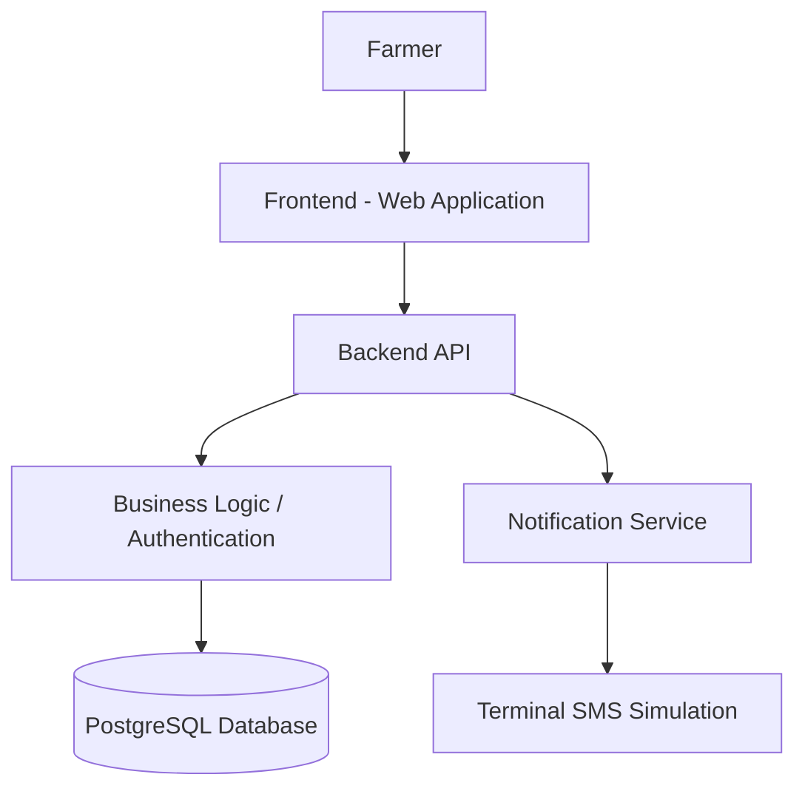

# 🌾 KisanQueue – Smart Agricultural Procurement Management System

**Smart India Hackathon (SIH) 2026 Prototype**

KisanQueue is a digital platform designed to improve the agricultural procurement-centre experience for farmers by digitizing registration, slot booking, queue management, procurement tracking, and payment status updates.

> ⚠️ **Prototype Notice:** This project is a working prototype built for SIH 2026. It is not a production-ready system. Several features described below may be planned or under active development — see [Prototype Limitations](#-prototype-limitations) for details.

---

## 📖 Table of Contents

- [Problem Statement](#-problem-statement)
- [Proposed Solution](#-proposed-solution)
- [Key Features](#-key-features)
- [Architecture](#-architecture-conceptual)
- [User Workflow](#-user-workflow-farmer)
- [Technology Stack](#-technology-stack)
- [SMS Notification Simulation](#-sms-notification-simulation)
- [Payment Tracking](#-payment-tracking)
- [Database](#-database)
- [API Documentation](#-api-documentation)
- [Installation and Running](#-installation-and-running)
- [Project Documentation](#-project-documentation)
- [Prototype Limitations](#-prototype-limitations)
- [Future Scope](#-future-scope)
- [Repository](#-repository)
- [License](#-license)

---

## 🧩 Problem Statement

Farmers visiting agricultural procurement centres commonly face:

- Long physical queues
- Overcrowding at centres
- Uncertain waiting times
- Manual, unorganized queue management
- Difficulty knowing their turn in the queue
- Limited visibility into procurement progress
- Difficulty tracking payment status for their produce

KisanQueue aims to digitize this workflow, making the procurement process more organized, transparent, and time-efficient for both farmers and procurement-centre staff.

---

## 💡 Proposed Solution

KisanQueue follows a straightforward, end-to-end workflow that takes a farmer from registration to final payment:

```
Farmer Registration
        ↓
   Slot Booking
        ↓
  Token Generation
        ↓
 Queue Management
        ↓
   Procurement
        ↓
  Payment Status
        ↓
  Notifications
```

---

## ✨ Key Features

Features are grouped by user role. Items not yet implemented are explicitly marked **(Planned)**.

### 👨‍🌾 Farmer

- Farmer registration
- Login / authentication
- Farmer profile management
- Procurement-centre selection
- Slot booking
- Token generation
- Queue-status tracking
- Procurement-status tracking
- Payment-status tracking
- Notifications (simulated SMS)

### 🏢 Procurement Centre Staff

- View farmer bookings
- Manage queue
- Manage tokens
- Update farmer status
- Record procurement
- Update payment status
- Trigger notifications

### 🛠️ Administrator

- Manage users/roles
- Manage procurement centres
- Monitor procurement activity
- Manage system configuration where required

> **Note:** Feature availability depends on the current implementation state of the codebase. Refer to `phase.md` for the up-to-date development status of each feature.

---

## 🏗️ Architecture (Conceptual)

The diagram below represents the **conceptual system architecture** as envisioned for this prototype. It is intended to communicate design intent and may not exactly mirror the current state of the codebase.

```
┌──────────────────────┐
│      Frontend        │
│   Web Application    │
└──────────┬───────────┘
           │
           ▼
┌──────────────────────┐
│      Backend API     │
│ Authentication       │
│ Business Logic       │
└──────────┬───────────┘
           │
           ▼
┌──────────────────────┐
│      PostgreSQL      │
│       Database       │
└──────────────────────┘

Backend
   │
   ▼
Notification Service
   │
   ▼
Terminal SMS Simulation
```



For the authoritative and detailed architecture, refer to `architecture.md`.

---

## 🔄 User Workflow (Farmer)

```
Register
   ↓
Login
   ↓
Select Procurement Centre
   ↓
Select Slot
   ↓
Book Slot
   ↓
Receive Token
   ↓
Track Queue
   ↓
Procurement
   ↓
Payment Status
```

---

## 🛠️ Technology Stack

Only technologies explicitly confirmed for this project are listed below. No frameworks, libraries, or tools are assumed.

| Component      | Technology                |
|----------------|----------------------------|
| Database       | PostgreSQL                 |
| Backend        | REST API                   |
| Frontend       | Web Application             |
| Notifications  | Terminal SMS Simulation    |

> Specific frameworks, libraries, and versions (e.g., for the backend or frontend) are intentionally not listed here until confirmed against the implementation. See `architecture.md` for further technical detail as the project evolves.

---

## 📲 SMS Notification Simulation

This prototype does **not** use Twilio or any real SMS gateway. All SMS notifications are **simulated through the terminal/console** for demonstration purposes.

```
Application
    ↓
Notification Service
    ↓
Terminal
```

**Example simulated output:**

```
[SMS SIMULATION]
To: +91XXXXXXXXXX
Message: Your procurement slot has been confirmed.
Token: A-104
Time: 10:30 AM
```

The notification layer is designed so that it can be connected to a real SMS provider (e.g., Twilio, MSG91) in a future iteration. **No real SMS messages are currently being sent.**

---

## 💰 Payment Tracking

"Payment tracking" refers to tracking the payment made **to the farmer** for agricultural produce procured by the procurement centre.

- A real payment gateway is **not** required or implemented for this SIH prototype.
- Payment status is represented and tracked digitally within the system (e.g., pending/completed).

---

## 🗄️ Database

The planned relational database for this project is **PostgreSQL**.

Expected major concepts/entities include:

- Users
- Farmers
- Procurement Centres
- Slots
- Bookings
- Tokens
- Queue
- Procurement Records
- Payments
- Notifications

> Detailed schema/column-level design is maintained in the project documentation and is not duplicated here to avoid inconsistency.

---

## 🔌 API Documentation

The backend is intended to expose REST APIs covering:

- Authentication
- Farmer management
- Procurement centres
- Slot booking
- Queue/token management
- Procurement
- Payments
- Notifications

The complete, authoritative API contract (endpoints, request/response schemas, etc.) is maintained separately in **`architecture.md`** or dedicated API documentation, and is intentionally not duplicated in this README.

---

## ⚙️ Installation and Running

Setup and run instructions will be added/updated according to the final frontend and backend implementation.

---

## 📚 Project Documentation

This project maintains additional documentation alongside this README:

| File              | Description                                      |
|-------------------|---------------------------------------------------|
| `PRD.md`          | Product requirements                              |
| `architecture.md` | System architecture                               |
| `rules.md`        | Development rules                                 |
| `phase.md`        | Development phases                                |
| `design.md`       | UI/UX design                                      |
| `memory.md`       | Persistent project decisions/context              |
| `README.md`       | Project overview and setup guide (this file)      |

---

## ⚠️ Prototype Limitations

- This is a **prototype-stage** system built for SIH 2026, not a production system.
- **No Twilio** or third-party SMS gateway is used.
- SMS notifications are **simulated through the terminal**, not delivered to real phone numbers.
- **No real payment gateway** is required or implemented; payment status is tracked digitally only.
- Production-grade deployment and infrastructure are **outside the current prototype scope**.
- Some features listed above may still be **under development**.

---

## 🚀 Future Scope

The following enhancements are proposed as **future work** and are **not** part of the current prototype:

- Real SMS gateway integration
- WhatsApp / app-based push notifications
- Mobile application
- Regional-language support
- Real payment gateway integration
- Advanced queue prediction (e.g., estimated wait times)
- Analytics dashboard
- QR-based farmer/token verification
- Cloud deployment
- Production-grade scalability improvements

---

## 🔗 Repository

GitHub Repository: [https://github.com/sani5228/SIH2026.git](https://github.com/sani5228/SIH2026.git)

---

## 📄 License

No license has been specified for this project at this time.

---

<div align="center">

Built for **Smart India Hackathon 2026** 🇮🇳

</div>
